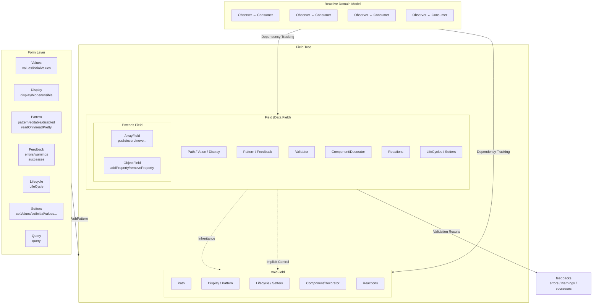
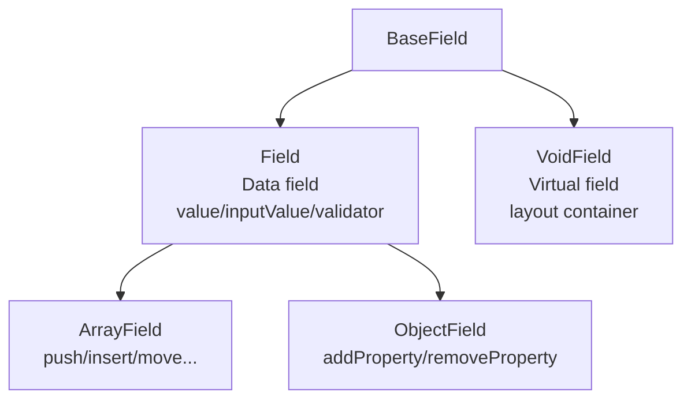
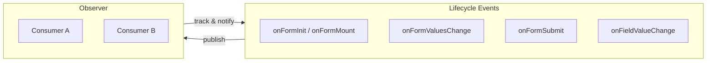
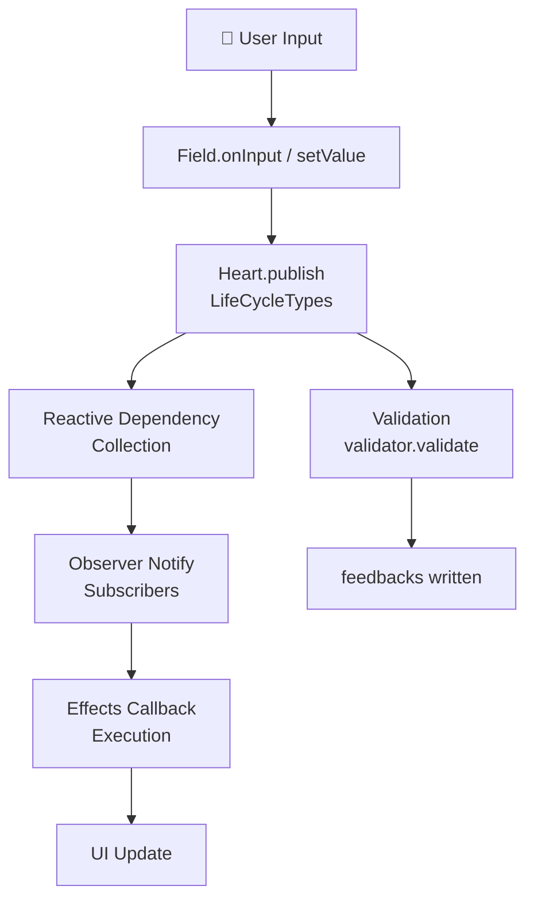

# Architecture

The architecture of `@silver-formily/core` is based on the MVVM pattern, decoupling form state, side effects, and validation logic into independent layers.

## Domain Model

The Formily kernel architecture addresses a domain-level problem, not a single point solution. Here's the architecture diagram:



## Core Modules

### Form

The root node of a form, aggregating Graph and Heart:

- **Values**: Dual management of values and initialValues with multiple merge strategies
- **Display**: display (visible/hidden/none) with convenience properties
- **Pattern**: pattern (editable/disabled/readOnly/readPretty)
- **Feedback**: errors, warnings, successes
- **Lifecycle**: Complete Form/Field lifecycle event system
- **Setters**: State manipulation methods
- **Query**: Path pattern matching for field lookup

### Field Model Hierarchy



### Effects System



```ts
import { onFieldValueChange, onFormSubmit } from '@silver-formily/core'

const form = createForm({
  effects() {
    onFormSubmit((form) => { /* ... */ })
    onFieldValueChange('*', (field) => { /* ... */ })
  },
})
```

## Data Flow


