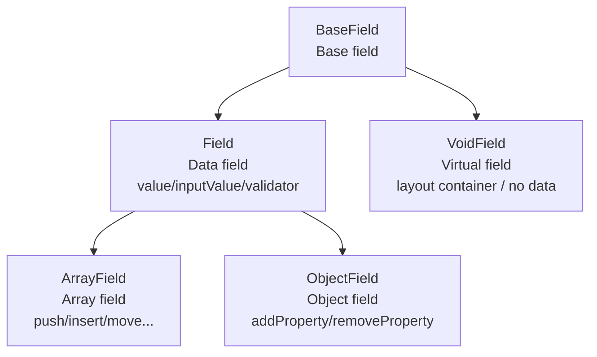

# Architecture

The architecture of `@silver-formily/core` is based on the MVVM pattern. It separates form state, side effects, and validation logic into independent layers.

## What Is a Domain Model?

Before diving into the architecture, it helps to understand one core idea: **Domain Model**.

Put simply, a domain model is an abstraction of the core concepts, rules, and relationships in a business domain. It does not care about technical implementation details, such as whether React or Vue renders the UI. Instead, it answers: what is the essence of this domain, who participates in it, and how do they collaborate?

For the form domain, if we put UI frameworks and component libraries aside, what is a form really about?

- It has **values**: what the user filled in
- It has **rules**: which fields are required and how they should be validated
- It has **state**: whether it is editable, disabled, read-only, or read-pretty
- It has **structure**: whether fields are flat, nested, or array-based
- It has **feedback**: whether validation passed and where errors occurred

Extracting these concepts into reusable models is what the Formily kernel does. This keeps the underlying logic consistent whether the upper layer uses Vue, React, or plain DOM. That is the value of a domain model.

## Domain Model

The Formily kernel architecture answers this question: "How can the form domain be abstracted into a stable set of models and collaboration relationships?" It is not about how a specific component renders.

So it is easier to understand it in two steps:

1. First, look at **how the core objects are layered**
2. Then, look at **how these objects collaborate when state changes**

### 1. Core Object Relationships

First, answer one question: what core objects exist in the Formily kernel, and what is each object responsible for?

<ThemeImage
  light="/architecture/domain-model.en.svg"
  dark="/architecture/domain-model.en.dark.svg"
  alt="Formily domain model architecture overview"
/>

The most important part of this diagram is the three-layer relationship:

- **Form** is the root model and aggregates the capabilities of the whole form
- **Field Tree** is the field organization structure and connects all nodes into a tree
- **Field** / **VoidField** are the two core node types in the tree: Field carries data, while VoidField focuses more on structure and layout

In TypeScript type declarations, both Field and VoidField are `GeneralField` (see the related [TypeChecker](/en/api/entry/FormChecker.html#isgeneralfield)). Their model fields differ in many ways, so TypeChecker is often needed to get complete type inference during usage. ArrayField and ObjectField are not brand-new models; they are extensions of Field for specific data structures, with additional methods.

### 2. Runtime Collaboration

Now look at the second question: when the user inputs a value, a field changes, or validation is triggered, how does the system flow internally?

<ThemeImage
  light="/architecture/coordination.en.svg"
  dark="/architecture/coordination.en.dark.svg"
  alt="Formily collaboration relationship"
/>

This diagram describes one main runtime line:

- User input or setter calls first change Form or Field state
- After state changes, Heart publishes lifecycle events
- Some changes trigger validation, and validation results are written into feedbacks
- Other changes are tracked by the Reactive system, which then notifies Observer and UI updates

In other words, **Form / Field Tree / Field / VoidField** are more like "domain objects", while **Heart / Reactive / Observer** are more like "mechanisms that make those objects run". Keeping these two kinds of concepts separate makes the architecture much easier to understand.

## Core Modules

### Form

Form is the root node of a form. It aggregates Graph and Heart, and provides the full set of form capabilities such as field creation, query, validation, and submit:

- **Values**: dual management of `values` and `initialValues`, with multiple merge strategies
- **Display control**: `display` (`visible` / `hidden` / `none`) and convenience properties `visible` / `hidden`
- **Interaction pattern**: `pattern` (`editable` / `disabled` / `readOnly` / `readPretty`)
- **Feedback**: `errors`, `warnings`, and `successes`
- **Lifecycle**: complete Form / Field lifecycle event system
- **Setters**: state setters such as `setValues` and `setInitialValues`
- **Node query**: `query()` supports path pattern matching

### Graph

Graph maintains the topology of all fields in a form:

- Fields are located in the graph by path
- Tree-shaped structure supports add, remove, update, and lookup operations
- Changes trigger the notification mechanism
- Query provides flexible field matching and batch operations

### Heart

Heart is the core event system:

- Registers and manages all LifeCycle instances
- Publishes notifications when lifecycle events are triggered
- Allows external effects functions to subscribe to events
- Provides the `createEffectHook` API for extending custom events

### Field Model Hierarchy

Field and VoidField are the two core field types. Field maintains data, while VoidField is a container field with data-maintenance capability removed. ArrayField and ObjectField extend Field:



There is a **parent-child inheritance** relationship between Field and VoidField: when a parent sets `display`, child nodes inherit it by default. There is also an **implicit control** relationship: parent state changes can affect child fields.

### Side Effects and Linkage System

The side-effect system should not be understood as an isolated "event chain". In the Formily kernel, field and form state are first defined as observable: reading state collects dependencies, and writing state triggers scheduling. `effects`, `reactions`, and UI `Observer` are different consumers built on top of this reactive mechanism.

Their main difference is the **semantic wrapper**:

- `reactions` keeps dependency semantics: it runs `reaction(field)` inside `autorun`; whichever field state is read inside the function is automatically tracked as a dependency
- `effects` keeps event semantics: built-in model reactions listen to key state changes, then publish `LifeCycleTypes` through Heart
- `Observer` keeps rendering semantics: after state read during rendering changes, only the related view is notified to update

<ThemeImage
  light="/architecture/reaction.en.png"
  dark="/architecture/reaction.en.dark.png"
  alt="Formily linkage system"
/>

Therefore, active side effects and passive linkage are not two unrelated systems underneath. Both rely on observable read/write tracking. They only differ in how the trigger is expressed afterward: `reactions` directly re-runs the linkage function, while `effects` first converts the change into a lifecycle event and then lets business hooks handle it.

Each event type has a corresponding Hook API:

```ts
import { onFieldValueChange, onFormSubmit } from '@silver-formily/core'

const form = createForm({
  effects() {
    onFormSubmit((form) => {
      // side effects when the form submits
    })
    onFieldValueChange('*', (field) => {
      // side effects when any field value changes
    })
  },
})
```

## Data Flow

<ThemeImage
  light="/architecture/data-flow.en.png"
  dark="/architecture/data-flow.en.dark.png"
  alt="Formily linkage system"
/>
