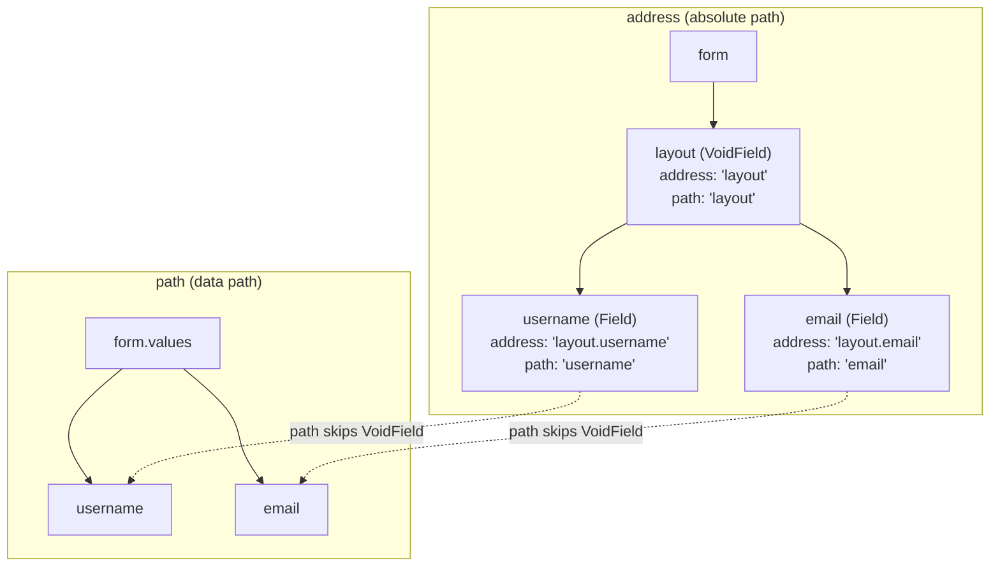
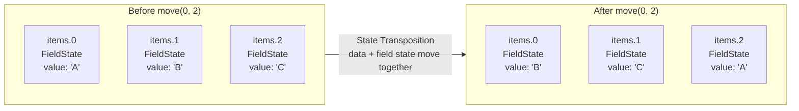

# Field Model

Formily's field model includes two categories: **data fields** and **virtual/void fields**.

- **Data Field (Field)**: Primary responsibility is maintaining form data — the values submitted with the form
- **Void Field (VoidField)**: A Field stripped of data-maintenance capability. Acts as a container for managing the UI presentation of a group of fields

## Data Fields

Data fields come in three concrete forms:

| Type          | Inheritance   | Responsibility                                          |
| ------------- | ------------- | ------------------------------------------------------- |
| `Field`       | —             | Manages non-auto-increment field state                  |
| `ArrayField`  | extends Field | Manages auto-increment lists with add/remove/move       |
| `ObjectField` | extends Field | Manages auto-increment objects with property add/remove |

> Field can hold **any data type** (including arrays and objects). The distinction: if you need array add/remove/move interactions, use ArrayField; if you need object property add/remove, use ObjectField. **If you don't need these interactions, use Field for all data types.**

Field's domain rules include:

### Path Rules

In practice, a form structure is a tree. In Formily, each field has an **absolute path (address)** and a **data path (path)**.

**address**: The node's absolute position in the form model tree, using dot notation. e.g., `a.b.c` means field c's parent is b, and b's parent is a.

**path**: Dedicated to data read/write. Since VoidField has an absolute path and can be a parent of data fields, using only address would misplace data. Path **skips VoidField nodes** when locating data.

Summary: **Address always represents the node's absolute path; Path skips VoidField nodes, but a VoidField's own Path preserves its own position.**

The diagram below illustrates the difference — VoidField nodes exist in address but are skipped in path:



```ts
const layout = form.createVoidField({ name: 'layout' })
const field = form.createField({ name: 'layout.username', value: '' })

console.log(field.address) // 'layout.username'  — absolute path
console.log(field.path) // 'username'        — data path (skips VoidField)

// Writing value: path targets form.values.username (skipping layout)
field.value = 'silver'
console.log(form.values) // { username: 'silver' }  ← layout not in data

// query works with both address and path
form.query('layout.username').take() // by address
form.query('username').take() // by path
```

### Display Rules

Field display is expressed via the `display` property with three values:

| display   | Meaning   | Effect on Data           |
| --------- | --------- | ------------------------ |
| `visible` | UI shown  | Restores field data      |
| `hidden`  | UI hidden | **Preserves** field data |
| `none`    | UI hidden | **Discards** field data  |

Convenience properties:

| Property  | Value | Equivalent           |
| --------- | ----- | -------------------- |
| `visible` | true  | `display: 'visible'` |
| `visible` | false | `display: 'none'`    |
| `hidden`  | true  | `display: 'hidden'`  |
| `hidden`  | false | `display: 'visible'` |

#### Default Inheritance

If a **parent sets display and the child hasn't**, the child **inherits** the parent's display. To cancel inheritance, set display to `null`:

```ts
field.setDisplay(null) // revert to inheriting from parent
```

### Data Read/Write Rules

Field does **not independently maintain data** — it operates on form data through the `path` property, ensuring absolute idempotency.

#### Read

```ts
field.value // current value
field.initialValue // initial value
field.inputValue // input value
```

#### Write

```ts
// 1. Direct property write (triggers reactive update)
field.value = 'new value'

// 2. onInput — simulates user input
//    Sets inputValue/inputValues, marks modified=true,
//    triggers onInput validation rules
field.onInput('input value')

// 3. setValue method
field.setValue('programmatic value')
```

### Data Source Rules

The `dataSource` property is for values that come from sources other than direct input (e.g., dropdown options):

```ts
field.dataSource = [
  { label: 'Option 1', value: '1' },
  { label: 'Option 2', value: '2' },
]
```

### Component & Decorator Rules

```ts
// Component: proxies the UI component for fine-grained linkage control
field.component = [InputComponent, { placeholder: 'Enter...' }]
field.setComponent(InputComponent, { placeholder: 'Enter...' })
field.setComponentProps({ placeholder: 'New placeholder' })

// Decorator: proxies the wrapper container (e.g., FormItem)
field.decorator = [FormItemComponent, { label: 'Username' }]
field.setDecorator(FormItemComponent, { label: 'Username' })
```

### Validation Rules

#### Validator Forms

**1. String (format shorthand):**

```ts
field.validator = 'email' // equivalent to { format: 'email' }
```

**2. Custom function:**

```ts
// return string on error
field.validator = value => value ? '' : 'Required'

// return { type, message }
field.validator = value => ({
  type: 'warning',
  message: 'Consider using a company email',
})

// return boolean with message
field.validator = {
  validator: value => value.length > 3,
  message: 'At least 3 characters',
}
```

**3. Object rules:**

```ts
field.validator = {
  format: 'email',
  required: true,
  minLength: 3,
}
```

**4. Array of rules (all forms ultimately convert to this):**

```ts
field.validator = [
  { required: true },
  { format: 'email', triggerType: 'onBlur' },
  { validator: value => value ? '' : 'error' },
]
```

#### Validation Timing

Add `triggerType` per rule: `onInput` (default), `onBlur`, `onFocus`.

#### Validation Results

```ts
interface Feedback {
  path: string
  address: string
  type: 'error' | 'success' | 'warning'
  code: 'ValidateError' | 'ValidateSuccess' | 'ValidateWarning'
    | 'EffectError' | 'EffectSuccess' | 'EffectWarning'
  messages: string[]
}
```

Reading results:

```ts
field.feedbacks // all feedback
field.errors // filtered to type 'error'
field.warnings // filtered to type 'warning'
field.successes // filtered to type 'success'

// self-prefix: field's own only; without: self + all descendants
field.selfErrors
field.errors // includes descendants
```

Writing results — two paths:

- **validate()** → code = `Validate*`
- **direct write to errors/warnings/successes** → code = `Effect*`

This separation prevents user-written feedback from polluting the validator's own results.

## ArrayField

> See [ArrayField API](/en/api/models/ArrayField) for details.

Extends Field with array methods that handle both data manipulation and child-field state transposition. When you call `list.move(0, 2)`, both the array data and the corresponding field states are transposed to keep data and UI consistent:



```ts
const list = form.createArrayField({ name: 'items', value: [] })
list.push({ title: 'item' })
list.remove(0)
list.move(0, 1)
```

## ObjectField

> See [ObjectField API](/en/api/models/ObjectField) for details.

Since objects are unordered, there's no state transposition. Adds three methods: `addProperty`, `removeProperty`, `existProperty`.

## VoidField

> See [VoidField API](/en/api/models/VoidField) for details.

Compared to Field, VoidField removes data read/write, data source, and validation rules. Use primarily for:

- Display rules (section visibility)
- Component rules (container proxying)
- Decorator rules (container decoration)

> This document explains the domain-level design of Formily's field model. For specific API details, consult the corresponding [API documentation](/en/api/models/Field).
