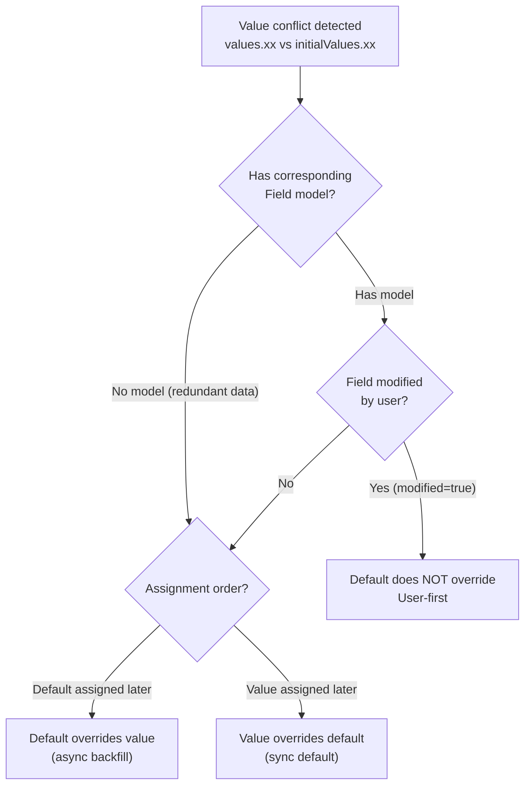
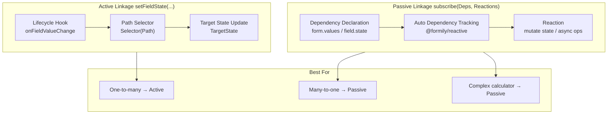

# Form Model

This continues the architecture and MVVM discussions, diving into the domain logic of the form model. If it feels abstract on first read, try browsing the API docs first, then come back for the design principles.

The entire form model breaks down into five core sub-models:

- **Field Management Model**: CRUD, import/export of fields
- **Field Model**: Behavior definitions for Field, ArrayField, ObjectField, VoidField
- **Data Model**: Value and default value management, selection and merge strategies
- **Validation Model**: Validation rule management and result management
- **Linkage Model**: Active and passive linkage patterns
- **Path System**: Unified DSL for field lookup, relationship expression, and data read/write

## Field Management Model

### Adding Fields

Create fields via Form factory methods. Existing fields are not recreated:

```ts
// Data field — manages non-auto-increment field state (Input, Select, DatePicker, etc.)
form.createField({ name: 'username', value: '' })

// Void field — does not pollute form data, only controls child visibility and interaction
form.createVoidField({ name: 'layout' })

// Array field — manages auto-increment list field state
form.createArrayField({ name: 'items', value: [] })

// Object field — manages auto-increment object field state
form.createObjectField({ name: 'profile', value: {} })
```

### Querying Fields

Via `form.query()`, supporting path or pattern matching. Path rules are detailed in [Path System](#path-system).

```ts
const query = form.query('users.*.name')

// Batch iteration
query.forEach((field) => { /* ... */ })
query.map(field => field.value)
query.reduce((acc, field) => {
  /* ... */
  return acc
}, init)

// Take first match
const field = query.take()

// Deep read
query.get('profile.name')
```

### Importing Fields

`setFormGraph` imports flat data where keys are absolute paths and values are field states. Useful for time-travel scenarios:

```ts
form.setFormGraph({
  username: { value: 'silver', visible: true },
})
```

### Exporting Fields

`getFormGraph` exports in the same format, returning Immutable data for persistence:

```ts
const graph = form.getFormGraph()
```

### Clearing Fields

```ts
form.clearFormGraph()
```

## Field Model

Four concrete field types correspond to different component patterns:

### Field Model

Manages **non-auto-increment** field state, corresponding to Input, Select, NumberPicker, DatePicker, etc.

```ts
const field = form.createField({
  name: 'username',
  value: '',
  title: 'Username',
  required: true,
  validator: { minLength: 3 },
})
```

### ArrayField Model

Manages **auto-increment list** state with add/remove/move operations:

```ts
const list = form.createArrayField({ name: 'items', value: [] })
list.push({ title: 'new item' })
list.remove(0)
list.move(0, 1)
```

### ObjectField Model

Manages **auto-increment object** state with add/remove for keys:

```ts
const obj = form.createObjectField({ name: 'profile', value: {} })
```

### VoidField Model

Manages **void field** state — does not pollute form data but controls child visibility and interaction:

```ts
const layout = form.createVoidField({ name: 'section', title: 'Basic Info' })
```

> See [Field API](/en/api/models/Field) for detailed API references.

## Data Model

The data model handles the lifecycle of values: form values, default values, and their merge strategies.

### Values vs InitialValues

| Concept         | Description         | On Reset |
| --------------- | ------------------- | -------- |
| `values`        | Current form values | Cleared  |
| `initialValues` | Form default values | Restored |

Simply put: on reset, fields return to the state defined by `initialValues`.

### Form Values

`form.values` is an observable property. With deep observer capability, it listens for any property change, triggering the `onFormValuesChange` lifecycle:

```ts
form.setValues({ username: 'silver' })
form.setValuesIn('profile.name', 'New Name')
form.deleteValuesIn('profile.temp')
```

### Field Values

Each data field maintains a `value` property. Reading/writing field values is essentially reading/writing the top-level form values — linked by `path`:

```ts
field.value = 'new value' // equivalent to
form.values[field.path] = 'new value'
```

### Merge Strategies

**When there is a conflict** (e.g., `{xx:123}` vs `{xx:321}`):

| Scenario                                                       | Behavior                                  |
| -------------------------------------------------------------- | ----------------------------------------- |
| Default assigned later, field modified by user (modified=true) | Default does **not** override field value |
| Default assigned later, field not modified                     | Default **overrides** field value         |
| Default assigned first, form value assigned later              | Form value **directly overrides** default |

**No conflict** (e.g., `{xx:123}` and `{yy:321}`): direct merge.

Core principle: **prioritize user modifications. If not user-modified, follow assignment order.**

The flowchart below shows the decision logic when values conflict:



```ts
form.setValues({ username: 'new' }) // overwrite (default)
form.setValues({ username: 'new' }, 'shallowMerge') // shallow merge
form.setValues({ profile: { name: 'new' } }, 'deepMerge') // deep merge
```

## Validation Model

The validation model belongs to the field model, with two core capabilities:

### Rule Management

```ts
field.setValidator({ required: true, minLength: 3 })
field.setValidatorRule('minLength', 6)
```

### Result Management

Validation results are written to the field's feedback area:

```ts
await field.validate()
field.selfErrors // field's own errors
field.selfWarnings // field's own warnings
field.valid // validation passed?
```

> See [@silver-formily/validator docs](https://validator.silver-formily.org/) for detailed mechanisms.

## Linkage Model

Formily provides two linkage models:

### Active Linkage (1.x style)

Expression: `setFieldState(Subscribe(FormLifeCycle, Selector(Path)), TargetState)`

Trigger state changes for fields at specified paths based on lifecycle hooks:

```ts
onFieldValueChange('source', (field) => {
  field.form.setFieldState('target', (state) => {
    state.value = field.value
  })
})
```

Best for **one-to-many** scenarios — most efficient. But for many-to-one, listening to multiple fields simultaneously can be cumbersome.

### Passive Linkage (2.x addition)

Expression: `subscribe(Dependencies, Reactions)`

Responds to dependency data changes — dependencies can be form model properties or any field model property:

```ts
form.createField({
  name: 'email',
  reactions: [
    (field) => {
      if (field.form.values.role === 'admin') {
        field.setRequired(true)
        field.setValidator({ format: 'email' })
      }
    },
  ],
})
```

This is a **complete linkage model**, more concise than active linkage in many-to-one scenarios. For one-to-many, active linkage may be more efficient.

The diagram below compares the two linkage models:



## Path System

The path system is used throughout the form model, providing three capabilities:

### Field Lookup

```ts
form.query('user.*.name').map()
form.query('**.email').take()
```

### Relationship Expression

```ts
field.parent // parent field
field.form // owning form
field.address // full path
```

### Data Read/Write

```ts
form.setValuesIn('profile.name', 'Silver')
const name = form.getValuesIn('profile.name')
```

The path system is based on `@silver-formily/path`'s path DSL. See [FormPath API](/en/api/entry/FormPath) for details.
