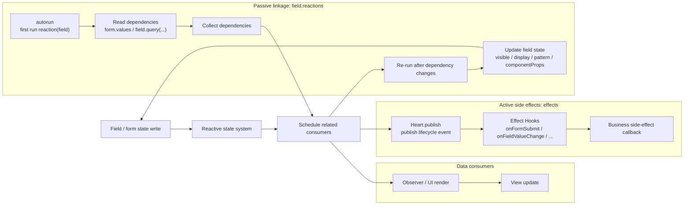

# Linkage System

The linkage system describes "what should happen after state changes." Formily provides two common entries: `effects` and `reactions`.

They look different: one is active event subscription, the other is passive dependency tracking. But both are built around reactive state changes. After state is written, the system schedules related consumers, and consumers then run side effects or update field state.



## effects: Active Side Effects

`effects` is useful when a lifecycle event should run some business logic.

```ts
import {
  createForm,
  onFieldValueChange,
  onFormSubmit,
} from '@silver-formily/core'

const form = createForm({
  effects() {
    onFieldValueChange('source', (field) => {
      field.form.setFieldState('target', (state) => {
        state.value = field.value
      })
    })

    onFormSubmit((form) => {
      console.log(form.values)
    })
  },
})
```

Active side effects:

- are triggered by lifecycle events
- can select target fields by paths
- work well when one change affects many targets
- read like imperative event subscriptions

## reactions: Passive Linkage

`reactions` is useful when the current field depends on state and should recompute itself when that state changes.

```ts
form.createField({
  name: 'email',
  reactions: [
    (field) => {
      const role = field.form.values.role

      field.required = role === 'admin'
      field.visible = role !== 'guest'

      field.setComponentProps({
        placeholder: role === 'admin' ? 'Admin email' : 'Email',
      })
    },
  ],
})
```

When `reaction(field)` runs for the first time, the reactive state it reads is collected as dependencies. When those dependencies change, the reaction runs again.

Passive linkage:

- is triggered by dependency tracking
- works well when multiple dependencies determine one field state
- reads like declarative computation
- reduces the need to manually wire multiple lifecycle hooks

## Choosing Between Them

| Scenario                                                             | Recommended |
| -------------------------------------------------------------------- | ----------- |
| One field change syncs many fields                                   | `effects`   |
| Multiple fields determine one field state                            | `reactions` |
| Submit, reset, validate, and other lifecycle side effects            | `effects`   |
| Field visibility, required state, component props, and derived state | `reactions` |

In real projects, both often exist together: `effects` handles event-like business flows, while `reactions` derives field state.

For the full runtime relationship, see [Architecture](/en/guide/architecture).
