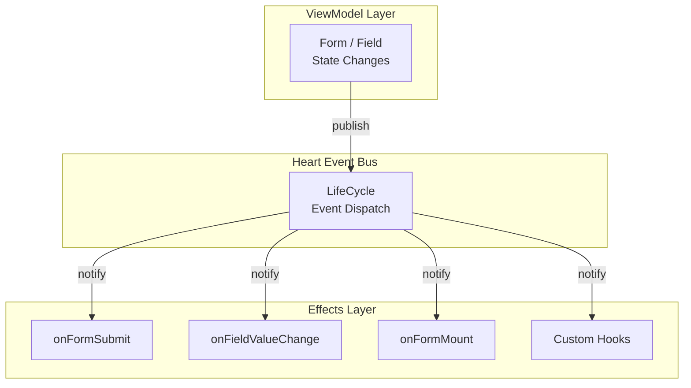

# MVVM Pattern

<script setup>
import ThemeImage from '../.vitepress/theme/components/ThemeImage.vue'
</script>

MVVM (Model-View-ViewModel) is an OOP architectural pattern. `@silver-formily/core` adopts this pattern to cleanly separate form **data**, **state**, and **side-effect logic**.

Here's a diagram to illustrate:

<ThemeImage
  light="/architecture/mvvm.png"
  dark="/architecture/mvvm.dark.png"
  alt="MVVM"
/>

- **View ↔ ViewModel**: Bidirectional via DataBinding. View passes user actions to ViewModel; ViewModel notifies View of state changes
- **ViewModel → Model**: One-way request. ViewModel reads/writes Model data; Model doesn't directly perceive ViewModel
- Bottom labels: View + ViewModel handle presentation; Model handles business logic and data

## Three-Layer Architecture

### Model — Data Layer

```ts
interface IFormState {
  values?: T
  initialValues?: T
  errors?: IFormFeedback[]
  valid?: boolean
  submitting?: boolean
}

interface IFieldState {
  value?: ValueType
  inputValue?: ValueType
  errors?: IFormFeedback[]
  valid?: boolean
  selfModified?: boolean
}
```

### ViewModel — View-Model Layer

```ts
form.setValues({ /* ... */ })
form.submit()
form.validate()

field.setValue('new value')
field.onInput('input value')
field.validate()
```

### View — Presentation Layer

Handled by UI frameworks (e.g., `@silver-formily/vue`).

## Reactive Principles

### 1. Observable State

```ts
class Form {
  values = observable({})
  initialValues = observable({})
}
```

### 2. Automatic Dependency Collection

```ts
autorun(() => {
  console.log(form.values.username) // auto-subscribes
})
```

### 3. Batch Updates

```ts
batch(() => {
  field.setState({ value: 'a' })
  field.setState({ visible: false })
})
```

## Side Effects & Lifecycle



```ts
createForm({
  effects(form) {
    onFormMount((form) => { /* ViewModel ready */ })
    onFieldValueChange('username', (field) => {
      // Model change → notify View
    })
  },
})
```
