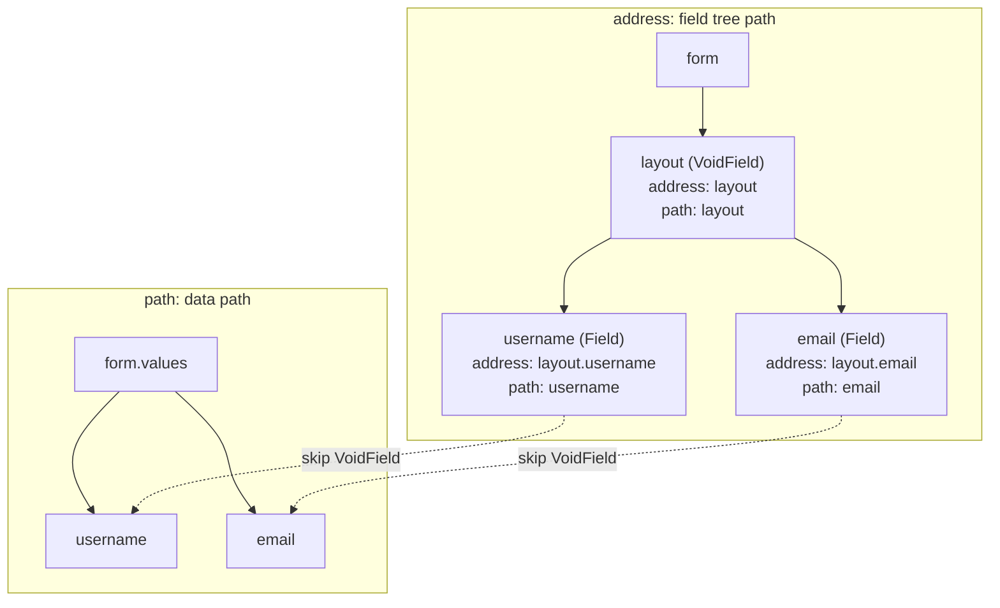

# Path System

The path system connects the field tree with form data. Form field creation, Query field lookup, Field parent-child relationships, and deep value operations all use the same path semantics.

## address vs path

Every field has two paths:

| Path      | Meaning                                                         |
| --------- | --------------------------------------------------------------- |
| `address` | Absolute position in the field tree, including every field node |
| `path`    | Data read/write path, skipping parent `VoidField` nodes         |

`VoidField` is a UI container and does not participate in form data. It appears in `address`, but it is skipped in the `path` of child data fields.



```ts
form.createVoidField({ name: 'layout' })

const field = form.createField({
  name: 'layout.username',
  value: '',
})

console.log(field.address) // 'layout.username'
console.log(field.path) // 'username'

field.value = 'silver'

console.log(form.values) // { username: 'silver' }
```

## Field Query

`form.query()` finds fields by path expressions. It can match both `address` and data field `path`.

```ts
form.query('layout.username').take()
form.query('username').take()
form.query('users.*.name').map()
form.query('**.email').forEach((field) => {
  field.disabled = true
})
```

Common wildcard semantics:

| Expression     | Meaning                                                   |
| -------------- | --------------------------------------------------------- |
| `*`            | Match one path segment                                    |
| `**`           | Match any depth                                           |
| `a.b`          | Exact path                                                |
| `users.*.name` | Match `name` fields under array items or dynamic children |

## Field Relationships

Field relationships are also expressed through paths:

```ts
field.parent // parent field
field.form // owner Form
field.address // absolute field tree path
field.path // data read/write path
```

Linkage logic can query related fields from the current field:

```ts
field.query('.target').take()
field.query('..parentField').take()
field.form.query('**.email').take()
```

## Data Read/Write

Form deep value helpers use the same `FormPath` semantics:

```ts
form.setValuesIn('profile.name', 'Silver')

const name = form.getValuesIn('profile.name')

form.deleteValuesIn('profile.name')
```

`field.value` is a convenience wrapper around the field `path`:

```ts
const field = form.createField({
  name: 'profile.name',
})

field.value = 'Silver'

console.log(form.values.profile.name) // 'Silver'
```

## Related Modules

- Form uses paths to create, query, and batch-operate fields
- Field uses `path` to read and write `form.values`
- Validation aggregates field feedback through paths
- Linkage uses paths to locate dependency and target fields

For the full path expression API, see [FormPath API](/en/api/entry/FormPath) and [Query API](/en/api/models/Query).
