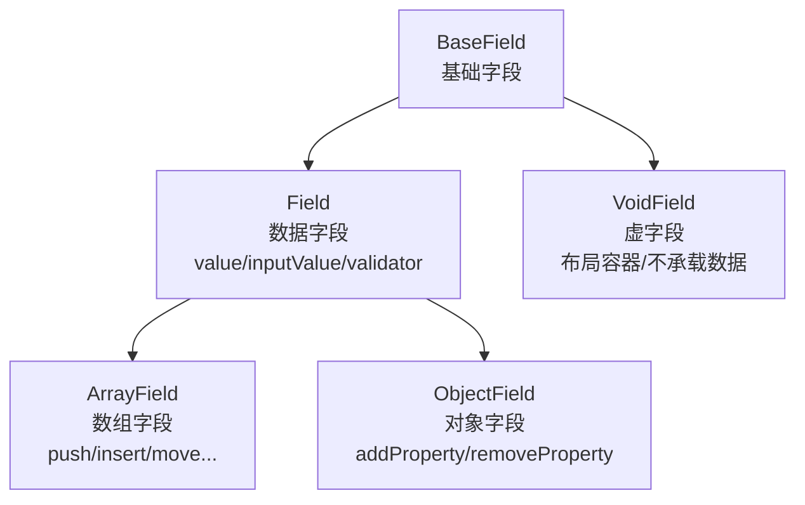

# 架构设计

<script setup>
import ThemeImage from '../.vitepress/theme/components/ThemeImage.vue'
</script>

`@silver-formily/core` 的架构基于 MVVM 模式，将表单状态、副作用和校验逻辑解耦为独立的层次。

## 什么是领域模型？

在深入架构之前，我们先理解一个核心概念——**领域模型（Domain Model）**。

简单来说，领域模型是对**业务领域中核心概念、规则和关系的抽象描述**。它不关心技术实现细节（比如用 React 还是 Vue 渲染），而是专注于回答"这个业务的核心是什么？有哪些参与者？它们之间如何协作？"

以表单领域为例，当你抛开 UI 框架、抛开具体组件库，表单的本质是什么？

- 有**值**（用户填了什么）
- 有**规则**（哪些必填、哪些需要校验）
- 有**状态**（当前是编辑中还是只读）
- 有**结构**（字段之间是平级、嵌套、还是数组）
- 有**反馈**（校验通过了吗？哪里出错了？）

把这些概念提炼成可复用的模型，就是 Formily 内核在做的事。这样无论上层用 Vue、React 还是原生 DOM，底层逻辑都是一致的——这就是领域模型的价值。

## 领域模型

Formily 内核架构要解决的是“表单这个领域如何被抽象成一组稳定的模型和协作关系”，而不是某个具体组件怎么渲染。因此这里更适合分两步理解：

1. 先看**核心对象是怎么分层的**
2. 再看**状态变化时，这些对象是怎么协作的**

### 1. 核心对象关系

先只回答一个问题：Formily 内核里到底有哪些核心对象，它们各自负责什么？

<ThemeImage
  light="/architecture/domain-model.svg"
  dark="/architecture/domain-model.dark.svg"
  alt="Formily 领域模型架构总览"
/>

这张图里最关键的是三层关系：

- **Form** 是根模型，负责聚合整个表单的能力
- **Field Tree** 是字段的组织结构，负责把所有节点串成一棵树
- **Field** / **VoidField** 是树上的两类核心节点：前者承载数据，后者更偏结构和布局。

Field / VoidField 两者在Typescript的类型声明中都是 `GeneralField`（参考相应的[TypeChecker](/api/entry/FormChecker.html#isgeneralfield)）。在模型的字段上有诸多不同，使用时想获得完整的类型推断经常会需要使用TypeChecker。ArrayField 和 ObjectField 也不是新的模型，而是 Field 在特定数据结构上的扩展。有额外的方法

### 2. 运行时协作关系

再看第二个问题：当用户输入、字段变化、校验触发时，系统内部是怎么流动的？

<ThemeImage
  light="/architecture/coordination.svg"
  dark="/architecture/coordination.dark.svg"
  alt="Formily 协作关系"
/>

这里表达的是一条运行主线：

- 用户输入或调用 setter，会先改变 Form 或 Field 的状态
- 状态变化后，Heart 负责把生命周期事件发布出去
- 一部分变化会触发校验，结果写入 feedbacks
- 另一部分变化会被 Reactive 系统追踪，再通知 Observer 和 UI 更新

换句话说，**Form / Field Tree / Field / VoidField** 更像“领域对象”，而 **Heart / Reactive / Observer** 更像“让这些对象运转起来的机制”。把这两类概念分开看，整个架构会容易理解很多。

## 核心模块

### Form (表单模型)

Form 是表单的根节点，聚合了 Graph 和 Heart，提供字段创建、查询、校验、提交等全部表单能力：

- **表单值**: values、initialValues 双层管理，支持多种合并策略
- **显隐控制**: display (visible/hidden/none) 和便捷属性 visible/hidden
- **交互模式**: pattern (editable/disabled/readOnly/readPretty)
- **消息反馈**: errors、warnings、successes 三类反馈
- **生命周期**: 完整的 Form/Field 生命周期事件系统
- **Setters**: setValues、setInitialValues 等状态设置方法
- **节点查询器**: query() 支持路径模式匹配

### Graph (字段图)

Graph 维护表单中所有字段的拓扑关系：

- 字段通过路径 (path) 在图中定位
- 支持树形结构的增删改查
- 变更时触发通知机制
- 通过 Query 进行灵活的字段匹配和批量操作

### Heart (事件总线)

Heart 是核心事件系统：

- 注册和管理所有 LifeCycle 实例
- 在生命周期事件触发时发布通知
- 支持外部通过 effects 函数订阅事件
- 提供 createEffectHook API 扩展自定义事件

### 字段模型层级

Field 和 VoidField 是两种核心字段类型。Field 负责数据维护，VoidField 是阉割了数据维护能力的容器字段。ArrayField 和 ObjectField 继承自 Field：



Field 和 VoidField 之间存在**父子继承**关系——当父节点设置 display 后，子节点默认继承。同时也存在**隐式控制**关系——父级的状态变更会联动影响子级。

### 副作用与联动系统

副作用系统不应该理解成一条单独的“事件链路”。在 Formily 内核里，字段和表单状态会先被定义成 observable：读取状态时收集依赖，写入状态时触发调度。`effects`、`reactions` 和 UI `Observer` 都是这套响应式机制之上的不同消费者。

它们的区别主要在**语义包装**上：

- `reactions` 保留依赖语义：在 `autorun` 中执行 `reaction(field)`，函数里读到哪些字段状态，就自动追踪哪些依赖
- `effects` 保留事件语义：内置模型 reaction 监听关键状态变化，再通过 Heart 发布 `LifeCycleTypes`
- `Observer` 保留渲染语义：渲染过程中读取过的状态变化后，只通知相关视图更新

<ThemeImage
  light="/architecture/reaction.png"
  dark="/architecture/reaction.dark.png"
  alt="Formily 联动系统"
/>

因此，主动副作用和被动联动的底层并不是两套互不相关的系统。它们都依赖 observable 的读写追踪，只是触发后的表达方式不同：`reactions` 直接重跑联动函数，`effects` 先转换成生命周期事件，再交给业务 Hook 处理。

每个事件类型都有对应的 Hook API：

```ts
import { onFieldValueChange, onFormSubmit } from '@silver-formily/core'

const form = createForm({
  effects() {
    onFormSubmit((form) => {
      // 表单提交时的副作用
    })
    onFieldValueChange('*', (field) => {
      // 任意字段值变化时的副作用
    })
  },
})
```

## 数据流

<ThemeImage
  light="/architecture/data-flow.png"
  dark="/architecture/data-flow.dark.png"
  alt="Formily 数据流"
/>
