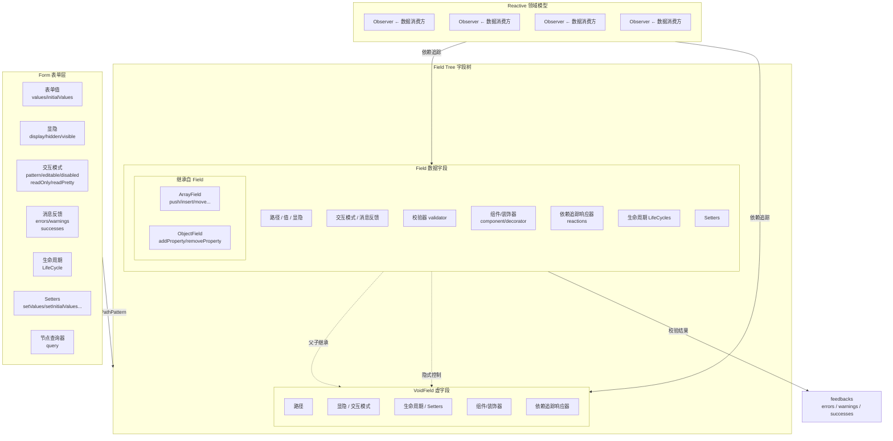
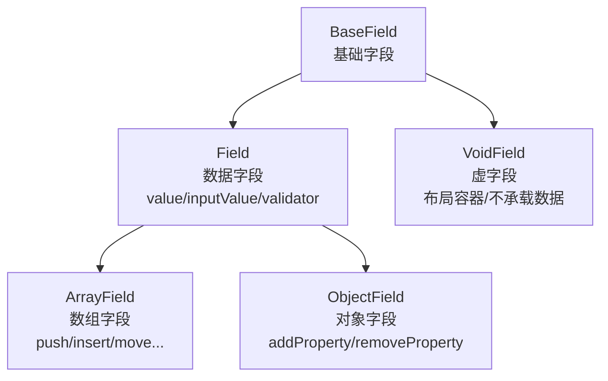
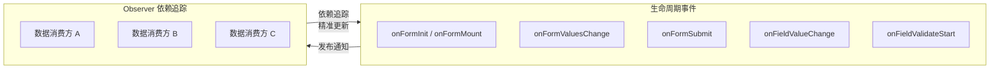
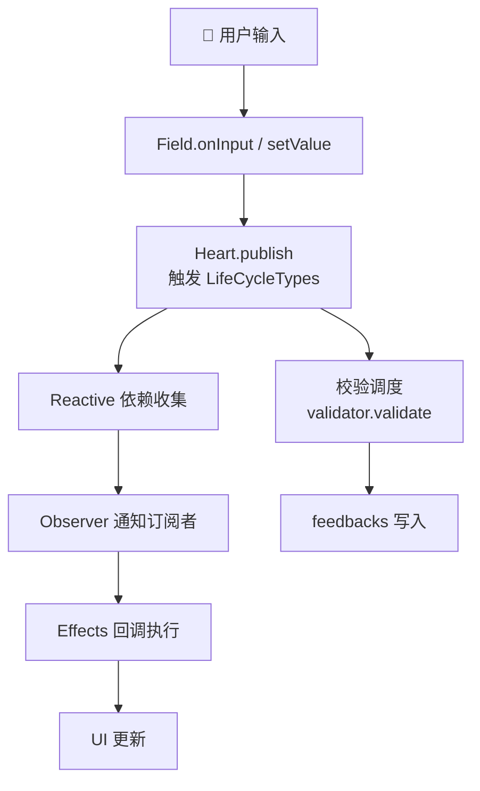

# 架构设计

`@silver-formily/core` 的架构基于 MVVM 模式，将表单状态、副作用和校验逻辑解耦为独立的层次。

## 领域模型

Formily 内核架构要解决一个领域级的问题，而非单点具体问题。先上架构图：



## 核心模块

### Form (表单模型)

Form 是表单的根节点，聚合了 Graph 和 Heart，提供字段创建、查询、校验、提交等全部表单能力：

- **表单值**: values、initialValues 双层管理，支持多种合并策略
- **显隐控制**: display (visible/hidden/none) 和便捷属性 visible/hidden
- **交互模式**: pattern (editable/disabled/readOnly/readPretty)
- **消息反馈**: errors、warnings、successes 三类反馈
- **生命周期**: 完整的 Form/Field 生命周期事件系统
- **Setters**: setValues、setInitialValues 等状态设置方法
- **节点查询器**: query() 支持路径模式匹配

### Graph (字段图)

Graph 维护表单中所有字段的拓扑关系：

- 字段通过路径 (path) 在图中定位
- 支持树形结构的增删改查
- 变更时触发通知机制
- 通过 Query 进行灵活的字段匹配和批量操作

### Heart (事件总线)

Heart 是核心事件系统：

- 注册和管理所有 LifeCycle 实例
- 在生命周期事件触发时发布通知
- 支持外部通过 effects 函数订阅事件
- 提供 createEffectHook API 扩展自定义事件

### 字段模型层级

Field 和 VoidField 是两种核心字段类型。Field 负责数据维护，VoidField 是阉割了数据维护能力的容器字段。ArrayField 和 ObjectField 继承自 Field：



Field 和 VoidField 之间存在**父子继承**关系——当父节点设置 display 后，子节点默认继承。同时也存在**隐式控制**关系——父级的状态变更会联动影响子级。

### 副作用系统 (Effects)

副作用系统通过 LifeCycleTypes 枚举定义了完整的事件类型，分为 Form 生命周期和 Field 生命周期。Reactive 领域模型中的 Observer（依赖追踪）会订阅这些状态变化：



每个事件类型都有对应的 Hook API：

```ts
import { onFieldValueChange, onFormSubmit } from '@silver-formily/core'

const form = createForm({
  effects() {
    onFormSubmit((form) => {
      // 表单提交时的副作用
    })
    onFieldValueChange('*', (field) => {
      // 任意字段值变化时的副作用
    })
  },
})
```

## 数据流



## 与上游的关系

`@silver-formily/core` 是 `@formily/core` 的 fork，保持核心模型 API、副作用系统、生命周期类型定义和校验调度机制的兼容。

主要差异：底层依赖包替换为 `@silver-formily/*` 系列，针对 Vue 生态优化，修复了部分上游问题。
