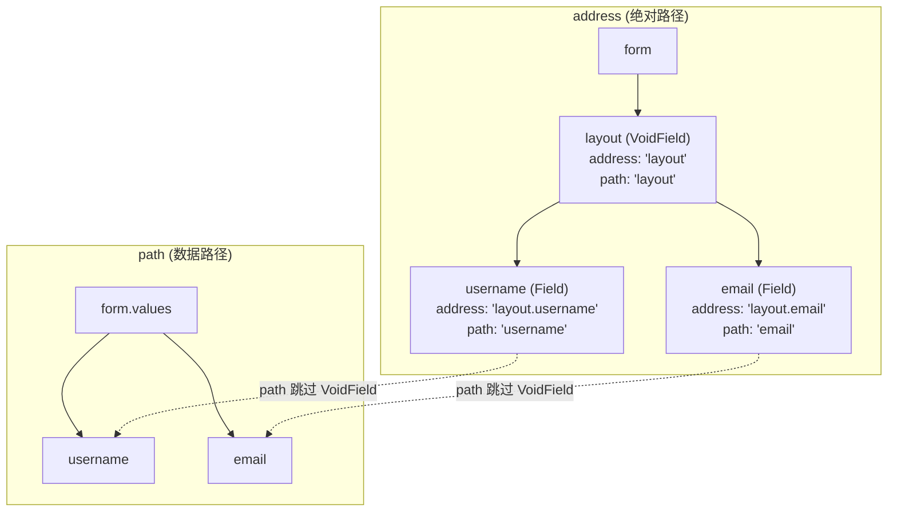
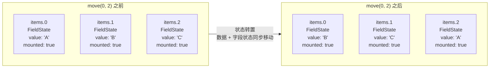

# 字段模型

Formily 的字段模型包含两大类：**数据型字段**和**虚数据型字段**。

- **数据型字段 (Field)**：主要职责是维护表单数据（表单提交时的值）
- **虚数据型字段 (VoidField)**：一个阉割了数据维护能力的 Field，主要充当容器，用于管理一批字段的 UI 展现形式

## 数据型字段

数据型字段共有三种具体形态：

| 类型          | 继承关系     | 职责                             |
| ------------- | ------------ | -------------------------------- |
| `Field`       | —            | 维护非自增型数据字段             |
| `ArrayField`  | 继承自 Field | 维护自增列表字段，支持增删移     |
| `ObjectField` | 继承自 Field | 维护自增对象字段，支持属性的增删 |

> 注意：Field 并不只能存储简单数据类型，它实际上可以存放**任意数据类型**（包括数组和对象）。区别在于：如果需要数组的添加、删除、移动等交互，应使用 ArrayField；如果需要对象属性的添加和删除交互，应使用 ObjectField。**没有这类需求时，所有数据类型统一使用 Field 即可。**

Field 的领域规则包含以下几项：

### 路径规则

在实际业务中，表单结构是一个树形结构。Formily 中每个字段都有一个**绝对路径 (address)** 和一个**数据路径 (path)**。

**address**：表示节点在表单模型树中的绝对位置，采用点语法描述。例如 `a.b.c` 表示字段 c 的父亲是 b，b 的父亲是 a。

**path**：专门用于数据字段的数据读写路径。由于 VoidField 虽然是虚数据字段，但同样拥有绝对路径，且可以作为数据字段的父亲，仅靠 address 会导致数据读写定位错误。因此 path 会**跳过 VoidField 的节点**来定位数据位置。

简单总结：**Address 永远是代表节点的绝对路径，Path 是会跳过 VoidField 的节点路径，但是如果是 VoidField 自身的 Path，会保留它自身的路径位置。**

下面这张图展示了 address 和 path 的区别——VoidField 节点在 address 中存在，但在 path 中被跳过：



```ts
// 创建嵌套结构
const layout = form.createVoidField({ name: 'layout' })
const field = form.createField({ name: 'layout.username', value: '' })

console.log(field.address) // 'layout.username'  — 绝对路径
console.log(field.path) // 'username'        — 数据路径（跳过了 VoidField）

// 写入值：path 定位到 form.values.username（跳过 VoidField）
field.value = 'silver'
console.log(form.values) // { username: 'silver' }  ← layout 不出现在数据中

// query 既可以按 address 也可以按 path 查询
form.query('layout.username').take() // 按 address
form.query('username').take() // 按 path，也能查到
```

### 显隐规则

字段的显示与隐藏通过 `display` 属性表达，有三种取值：

| display 值 | 含义         | 对数据的影响       |
| ---------- | ------------ | ------------------ |
| `visible`  | 字段 UI 显示 | 恢复字段数据       |
| `hidden`   | 字段 UI 隐藏 | **保留**字段数据   |
| `none`     | 字段 UI 隐藏 | **不保留**字段数据 |

在 display 之上还提供了两个便捷属性：

| 属性      | 取值  | 含义                        |
| --------- | ----- | --------------------------- |
| `visible` | true  | 等同于 `display: 'visible'` |
| `visible` | false | 等同于 `display: 'none'`    |
| `hidden`  | true  | 等同于 `display: 'hidden'`  |
| `hidden`  | false | 等同于 `display: 'visible'` |

#### 默认继承逻辑

如果**父节点主动设置了 display 属性而子节点未主动设置**，则子节点会**继承**父节点的 display。

主动设置 display 的情况包括：

- 初始化时配置了 `display` / `visible` / `hidden` 属性
- 初始化时未配置，但后续调用了 setter 方法

若想取消继承，将 display 设为 `null` 即可：

```ts
field.setDisplay(null) // 恢复为继承父节点的 display
```

### 数据读写规则

Field 是数据型字段，它**不独立维护数据**，而是通过 `path` 属性直接操作表单数据，保证表单数据与字段数据的绝对幂等。

#### 读取

直接读取 `value` / `initialValue` 属性即可：

```ts
console.log(field.value) // 当前值
console.log(field.initialValue) // 初始值
console.log(field.inputValue) // 输入值
```

#### 写入

三种写入方式：

```ts
// 1. 直接修改属性（会触发响应式更新）
field.value = 'new value'
field.initialValue = 'default'

// 2. 调用 onInput（模拟用户输入）
//    会写入数据，设置 inputValue/inputValues
//    将 modified 设置为 true
//    触发 triggerType 为 'onInput' 的校验规则
field.onInput('input value')

// 3. 调用 setValue 方法
field.setValue('programmatic value')
```

### 数据源规则

字段的值除了来自输入框输入，还可能从数据源中选取（如下拉框选项）。`dataSource` 属性专门用于读取数据源：

```ts
// 写入数据源
field.dataSource = [
  { label: '选项1', value: '1' },
  { label: '选项2', value: '2' },
]
// 或
field.setDataSource([/* ... */])
```

消费端（UI 组件）需要自己完成数据源的映射和展示。

### 字段组件规则

字段模型需要代理 UI 组件信息以实现精细化联动控制。例如 A 字段值变化要控制 B 字段的 placeholder。Formily 提供了 `component` 属性来代理 UI 组件信息。

`component` 的结构是一个数组 `[Component, ComponentProps]`：

```ts
field.component = [InputComponent, { placeholder: '请输入' }]
// 或
field.setComponent(InputComponent, { placeholder: '请输入' })
// 仅设置组件属性
field.setComponentProps({ placeholder: '新 placeholder' })
```

### 字段装饰器规则

与组件规则类似，字段装饰器用于维护字段的包裹容器（如 FormItem），偏重 UI 布局控制。用 `decorator` 属性描述：

```ts
field.decorator = [FormItemComponent, { label: '用户名' }]
// 或
field.setDecorator(FormItemComponent, { label: '用户名' })
field.setDecoratorProps({ label: '新标签' })
```

### 校验规则

校验规则是字段模型中内容最丰富的部分，包括：校验器、校验时机、校验策略和校验结果。

#### 校验器

校验器用 `validator` 属性描述。有以下几种形态：

**1. 纯字符串格式校验**

字符串会被当成 `format`，是正则规则的简写形式：

```ts
field.validator = 'email' // 等价于 { format: 'email' }
field.validator = 'phone'
field.validator = 'url'
```

Formily 内置了标准正则规则，也可以通过 `registerValidateFormats` 注册自定义格式。

**2. 自定义函数校验**

三种返回值模式：

```ts
// 模式一：返回字符串表示有错误，不返回表示无错误
field.validator = (value) => {
  return value ? '' : '不能为空'
}

// 模式二：返回 { type, message } 对象
field.validator = (value) => {
  return {
    type: 'warning', // 'error' | 'warning' | 'success'
    message: '建议填写公司邮箱',
  }
}

// 模式三：返回布尔值，错误消息复用 message 字段
field.validator = {
  validator: value => value.length > 3,
  message: '至少 3 个字符',
}
```

**3. 对象结构校验**

更完备的表达方式：

```ts
field.validator = {
  format: 'email',
  required: true,
  minLength: 3,
  maxLength: 20,
  pattern: /^[a-z]+$/,
  message: '格式不正确',
}
```

也可通过 `registerValidateRules` 注册自定义校验规则后使用。

**4. 对象数组结构校验**

是前三种形式的组合。注意：前三种形式最终都会被转换为对象数组结构：

```ts
// 下面三种写法等价

// 写法一：混合数组
field.validator = ['email', { required: true }, value => value ? '' : '错误']

// 写法二：对象数组
field.validator = [
  { format: 'email' },
  { required: true },
  { validator: value => value ? '' : '错误' },
]
```

#### 校验时机

可以在每个校验规则对象中添加 `triggerType` 来控制特定规则的触发事件：

| triggerType | 触发时机       |
| ----------- | -------------- |
| `onInput`   | 输入时（默认） |
| `onBlur`    | 失焦时         |
| `onFocus`   | 聚焦时         |

```ts
field.validator = [
  { required: true }, // 默认 onInput
  { format: 'email', triggerType: 'onBlur' }, // 失焦时才校验
]
```

调用 `form.validate()` 会一次性校验**所有 triggerType** 的规则；手动调用 `field.validate()` 可在入参中指定 triggerType，不传则校验全部。

#### 校验策略

若希望某个字段在校验时一旦某个规则失败就立即返回结果，可设置 `validateFirst`：

```ts
field.setValidateFirst(true)

// 或初始化时
form.createField({ name: 'username', validateFirst: true })
```

默认为 `false`，即校验失败仍会继续执行所有规则，返回所有错误。

#### 校验结果读取

校验结果存放在 `feedbacks` 属性中，是 Feedback 对象组成的数组：

```ts
interface Feedback {
  path: string
  address: string
  type: 'error' | 'success' | 'warning'
  code: 'ValidateError' | 'ValidateSuccess' | 'ValidateWarning'
    | 'EffectError' | 'EffectSuccess' | 'EffectWarning'
  messages: string[]
}
```

四种读取方式：

```ts
field.feedbacks // 所有反馈消息
field.errors // 过滤出 type 为 'error' 的结果
field.warnings // 过滤出 type 为 'warning' 的结果
field.successes // 过滤出 type 为 'success' 的结果
```

> **self 前缀说明**：`field.selfErrors` 只包含字段自身的错误，`field.errors` 包含自身+所有子孙字段的错误。校验结果同理。

#### 校验结果写入

三种写入方式：

**1. 调用 `validate` 方法**（结果 code 统一为 `Validate*`）：

以下操作会触发 validate：

- 调用 `field.onInput()`
- 调用 `field.onFocus()`
- 调用 `field.onBlur()`
- 调用 `field.validate()`
- 调用 `field.reset({ validate: true })`

**2. 直接修改 `feedbacks` 属性**

**3. 直接修改 `errors`/`warnings`/`successes` 属性**

会转换为 feedbacks 对象数组，同时 code 被强制覆盖为对应的 `Effect*`。这样设计是为了**防止用户修改的校验结果污染校验器本身的校验结果，做严格分离，方便恢复现场**。

#### 校验结果查询

```ts
// 按类型过滤
field.queryFeedbacks({ type: 'error' })

// 按 code 过滤
field.queryFeedbacks({ code: 'ValidateError' })

// 按路径过滤
field.queryFeedbacks({ address: 'username' })
```

## ArrayField

> 详细 API 请参考 [ArrayField API](/api/models/ArrayField)

ArrayField 继承自 Field，在此基础上扩展了数组相关方法。这些方法不仅对字段数据做处理，还提供了对 ArrayField 子节点状态的**转置处理**，以确保字段的顺序与数据的顺序保持一致。

```ts
const list = form.createArrayField({ name: 'items', value: [] })

list.push({ title: 'item' }) // 添加到末尾
list.insert(0, { title: 'new' }) // 在指定位置插入
list.remove(0) // 移除指定位置
list.move(0, 1) // 移动元素位置
list.moveUp(1) // 上移
list.moveDown(0) // 下移
```

以 `move` 为例说明转置。当调用 `list.move(0, 2)` 时，不仅数组数据中的元素位置变了，对应位置的字段状态也会随之移动，确保数据和 UI 一致：



数组数据从 `['A','B','C']` 变为 `['B','C','A']`，同时 `items.0`、`items.1`、`items.2` 三个字段的状态也被整体转置——这就是 ArrayField 与普通数组操作的本质区别。

## ObjectField

> 详细 API 请参考 [ObjectField API](/api/models/ObjectField)

由于 object 类型是无序的，不存在 ArrayField 那样的状态转置问题。ObjectField 提供了三个额外的方法：

```ts
const obj = form.createObjectField({ name: 'profile', value: {} })

obj.addProperty('name', 'Silver') // 添加属性
obj.removeProperty('temp') // 移除属性
obj.existProperty('name') // 属性是否存在
```

## VoidField

> 详细 API 请参考 [VoidField API](/api/models/VoidField)

相比 Field，VoidField 去掉了**数据读写规则**、**数据源规则**和**校验规则**。用户使用时主要用到的是：

- **显隐规则**：控制区域可见性
- **组件规则**：代理容器组件
- **装饰器规则**：代理容器装饰器

```ts
const layout = form.createVoidField({
  name: 'section',
  title: '基本信息',
  component: [CardComponent],
})
```

> 本文档从领域规则层面帮助你理解 Formily 的字段模型设计思路。对 API 不熟悉时请查阅对应的 [API 文档](/api/models/Field)。
