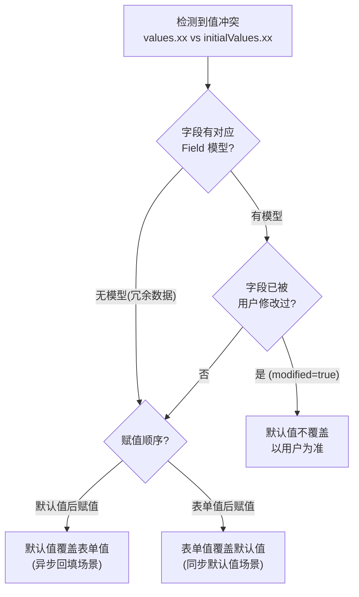
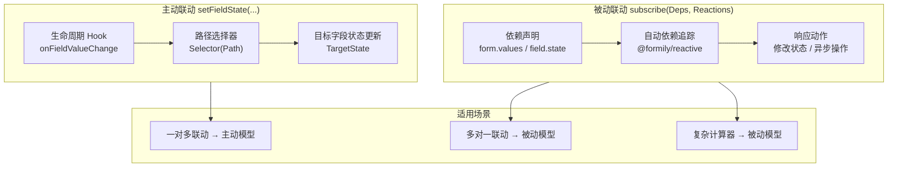

# 表单模型

本文延续了架构设计和 MVVM 模式的讨论，深入讲解表单模型的领域逻辑。如果第一遍阅读感觉抽象，建议先浏览 API 文档，再回来理解这些设计原则。

整个表单模型可以分解为五个核心子模型：

- **字段管理模型**：字段的增删查改、导入导出
- **字段模型**：Field、ArrayField、ObjectField、VoidField 的行为定义
- **数据模型**：值与默认值的管理、选择合并策略
- **校验模型**：校验规则管理和结果管理
- **联动模型**：主动联动与被动联动两种模式
- **路径系统**：字段查找、关系表达、数据读写的统一 DSL

## 字段管理模型

### 字段添加

通过 Form 实例提供的工厂方法创建字段，如果字段已存在则不会重复创建：

```ts
// 数据字段 — 管理非自增型字段状态（Input、Select、DatePicker 等）
form.createField({ name: 'username', value: '' })

// 虚字段 — 不污染表单数据，仅控制子节点的显示隐藏和交互模式
form.createVoidField({ name: 'layout' })

// 数组字段 — 管理自增列表字段状态
form.createArrayField({ name: 'items', value: [] })

// 对象字段 — 管理自增对象字段状态
form.createObjectField({ name: 'profile', value: {} })
```

### 字段查询

通过 `form.query()` 实现，支持传入字段路径或模式进行匹配。路径规则在[路径系统](#路径系统)部分详解。

```ts
// 返回 Query 对象
const query = form.query('users.*.name')

// 批量遍历
query.forEach((field) => { /* ... */ })
query.map(field => field.value)
query.reduce((acc, field) => {
  /* ... */
  return acc
}, init)

// 取首个匹配字段
const field = query.take()

// 深层读取（无类型提示）
query.get('profile.name')
```

### 导入字段集

使用 `setFormGraph` 导入扁平格式数据，key 是字段的绝对路径，value 是字段的状态。适用于时间旅行场景，将 Immutable 字段状态导入表单：

```ts
form.setFormGraph({
  username: { value: 'silver', visible: true },
  email: { value: 'a@b.com', mounted: true },
})
```

### 导出字段集

使用 `getFormGraph` 导出，格式与导入一致，返回 Immutable 数据，可持久化存储以支持时间旅行：

```ts
const graph = form.getFormGraph()
```

### 清空字段集

```ts
form.clearFormGraph()
```

## 字段模型

表单系统中存在四种具体字段类型，每种对应不同的组件形态：

### Field 模型

管理**非自增型**字段状态，对应 Input、Select、NumberPicker、DatePicker 等组件。

```ts
const field = form.createField({
  name: 'username',
  value: '',
  title: '用户名',
  required: true,
  validator: { minLength: 3 },
})
```

### ArrayField 模型

管理**自增列表**字段状态，支持列表项的增删移动：

```ts
const list = form.createArrayField({ name: 'items', value: [] })
list.push({ title: 'new item' })
list.remove(0)
list.move(0, 1)
```

### ObjectField 模型

管理**自增对象**字段状态，支持对象 key 的增删：

```ts
const obj = form.createObjectField({ name: 'profile', value: {} })
```

### VoidField 模型

管理**虚字段**状态。虚字段是一种不会污染表单数据的节点，但可以控制子节点的显示隐藏及交互模式：

```ts
const layout = form.createVoidField({
  name: 'section',
  title: '基本信息',
})
```

> 四种字段模型的详细 API 请参考 [Field API](/api/models/Field) 章节。

## 数据模型

数据模型负责值的生命周期管理，主要包括表单值、默认值以及它们的选择合并策略。

### 值与默认值的区别

| 概念            | 说明       | 重置行为         |
| --------------- | ---------- | ---------------- |
| `values`        | 表单当前值 | 重置后被清空     |
| `initialValues` | 表单默认值 | 重置后恢复为此值 |

简单来说：表单重置时，字段会回到 `initialValues` 定义的状态。

### 表单值管理

`form.values` 是一个 observable 属性，借助深度 observer 能力监听任意属性变化，触发 `onFormValuesChange` 生命周期钩子：

```ts
// 设置表单值
form.setValues({ username: 'silver', email: 'a@b.com' })

// 设置深层值
form.setValuesIn('profile.name', 'New Name')

// 删除深层值
form.deleteValuesIn('profile.temp')
```

### 字段值管理

每个数据型字段维护 `value` 属性，对字段值的读写实质上是对顶层表单 `values` 的操作。值的管理都在顶层表单上，字段的值与表单的值通过 `path` 实现绝对幂等：

```ts
field.value = 'new value' // 等价于
form.values[field.path] = 'new value'
```

### 值与默认值的选择合并策略

针对数据回显需求，存在以下规则：

**存在冲突时**（如表单值 `{xx:123}`，默认值 `{xx:321}`）：

| 场景                                           | 行为                     |
| ---------------------------------------------- | ------------------------ |
| 默认值后赋值，字段被用户修改过 (modified=true) | 默认值**不覆盖**字段值   |
| 默认值后赋值，字段未被修改过                   | 默认值**覆盖**字段值     |
| 默认值先赋值，表单值后赋值                     | 表单值**直接覆盖**默认值 |

**不存在冲突时**（如 `{xx:123}` 与 `{yy:321}`）：直接合并。

核心原则：**看该字段是否被用户修改过，一切以用户为准。如果没被用户修改过，就以赋值顺序为准。**

下面的流程图展示了值冲突时的决策逻辑：



```ts
// 合并策略
form.setValues({ username: 'new' }) // 覆盖（默认）
form.setValues({ username: 'new' }, 'shallowMerge') // 浅合并
form.setValues({ profile: { name: 'new' } }, 'deepMerge') // 深合并
```

## 校验模型

校验模型隶属于字段模型，核心包含两项能力：

### 校验规则管理

```ts
// 设置校验规则
field.setValidator({
  required: true,
  minLength: 3,
  message: '至少 3 个字符',
})

// 动态修改规则
field.setValidatorRule('minLength', 6)
```

### 校验结果管理

校验结果会写入字段的反馈区：

```ts
await field.validate()

field.selfErrors // 字段自身的错误
field.selfWarnings // 字段自身的警告
field.selfSuccesses // 字段自身的成功消息
field.valid // 是否校验通过
```

> 校验模型的详细机制请参考 [@silver-formily/validator 文档](https://validator.silver-formily.org/)。

## 联动模型

Formily 提供两种联动模型，可根据场景选择。

### 主动联动模型（1.x 风格）

表达式：`setFieldState(Subscribe(FormLifeCycle, Selector(Path)), TargetState)`

基于表单生命周期钩子触发指定路径下字段的状态变更：

```ts
// 当 source 字段值变化时，联动修改 target 字段
onFieldValueChange('source', (field) => {
  field.form.setFieldState('target', (state) => {
    state.value = field.value
  })
})
```

适合**一对多联动**场景，效率最高。但在多对一联动场景下，需要同时监听多个字段变化，实现成本较高。

### 被动联动模型（2.x 新增）

表达式：`subscribe(Dependencies, Reactions)`

针对依赖数据变化做响应，依赖数据可以是表单模型属性或任意字段模型的属性：

```ts
// 声明式联动：字段的 reactions 配置
form.createField({
  name: 'email',
  reactions: [
    (field) => {
      // 依赖 form.values.role，变化时自动重新执行
      if (field.form.values.role === 'admin') {
        field.setRequired(true)
        field.setValidator({ format: 'email' })
      }
    },
  ],
})
```

这是**完备的联动模型**，在多对一场景下比主动模型更简洁。但在一对多场景下，实现成本高于主动模型。

> 两种模型各有所长，根据实际需求选择。

下图对比了两种联动模型的适用场景：



## 路径系统

路径系统在整个表单模型中广泛使用，提供三大能力：

### 字段查找

从字段集中按规则查找任意字段，支持批量查找：

```ts
form.query('user.*.name').map() // 查找 user 下所有 name 字段
form.query('**.email').take() // 查找任意层级的 email 字段
```

### 字段关系表达

借助路径系统可查找字段的父节点，实现树级别的数据继承能力；也可以查找相邻节点：

```ts
field.parent // 父字段
field.form // 所属表单
field.address // 字段地址（全路径）
```

### 字段数据读写

支持带解构的数据读写：

```ts
form.setValuesIn('profile.name', 'Silver')
const name = form.getValuesIn('profile.name')
```

路径系统基于 `@silver-formily/path` 的路径 DSL 实现，详细内容参考 [FormPath API 文档](/api/entry/FormPath)。
