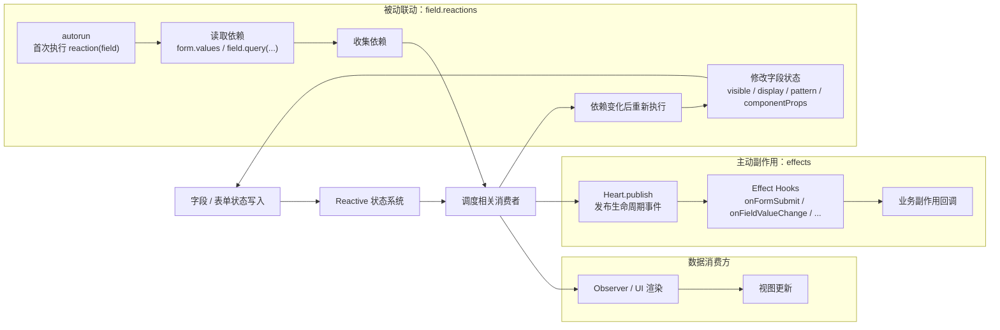

# 联动系统

联动系统用于描述“状态变化后要做什么”。Formily 提供两种常用入口：`effects` 和 `reactions`。

它们看起来一个是主动订阅，一个是被动依赖追踪，但底层都围绕响应式状态变化展开：状态被写入后，系统调度相关消费者，消费者再执行副作用或更新字段状态。



## effects：主动副作用

`effects` 适合表达“某个生命周期事件发生时，执行一段业务逻辑”。

```ts
import {
  createForm,
  onFieldValueChange,
  onFormSubmit,
} from '@silver-formily/core'

const form = createForm({
  effects() {
    onFieldValueChange('source', (field) => {
      field.form.setFieldState('target', (state) => {
        state.value = field.value
      })
    })

    onFormSubmit((form) => {
      console.log(form.values)
    })
  },
})
```

主动副作用的特点：

- 由生命周期事件触发
- 可以通过路径选择目标字段
- 适合“一处变化，批量影响多个目标”的场景
- 更像命令式流程，读起来接近事件订阅

## reactions：被动联动

`reactions` 适合表达“当前字段依赖哪些状态，这些状态变化后自动重新计算字段状态”。

```ts
form.createField({
  name: 'email',
  reactions: [
    (field) => {
      const role = field.form.values.role

      field.required = role === 'admin'
      field.visible = role !== 'guest'

      field.setComponentProps({
        placeholder: role === 'admin' ? '请输入管理员邮箱' : '请输入邮箱',
      })
    },
  ],
})
```

首次执行 `reaction(field)` 时，读取到的响应式状态会被自动收集为依赖。后续依赖变化时，该 reaction 会重新执行。

被动联动的特点：

- 由依赖追踪触发
- 适合“多个依赖共同决定一个字段状态”的场景
- 更像声明式计算，字段状态由依赖状态推导出来
- 可以减少手写多个 lifecycle hook 的成本

## 如何选择

| 场景                               | 推荐方式    |
| ---------------------------------- | ----------- |
| 一个字段变化后同步多个字段         | `effects`   |
| 多个字段共同决定一个字段状态       | `reactions` |
| 提交、重置、校验等生命周期副作用   | `effects`   |
| 字段显隐、必填、组件属性等状态推导 | `reactions` |

实际项目中两者经常同时存在：`effects` 负责事件型业务流程，`reactions` 负责字段状态推导。

更完整的运行时关系，请阅读 [架构设计](/guide/architecture)。
