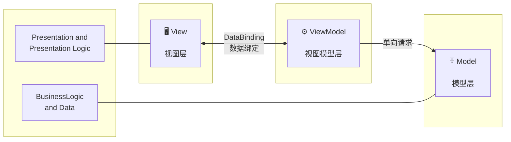
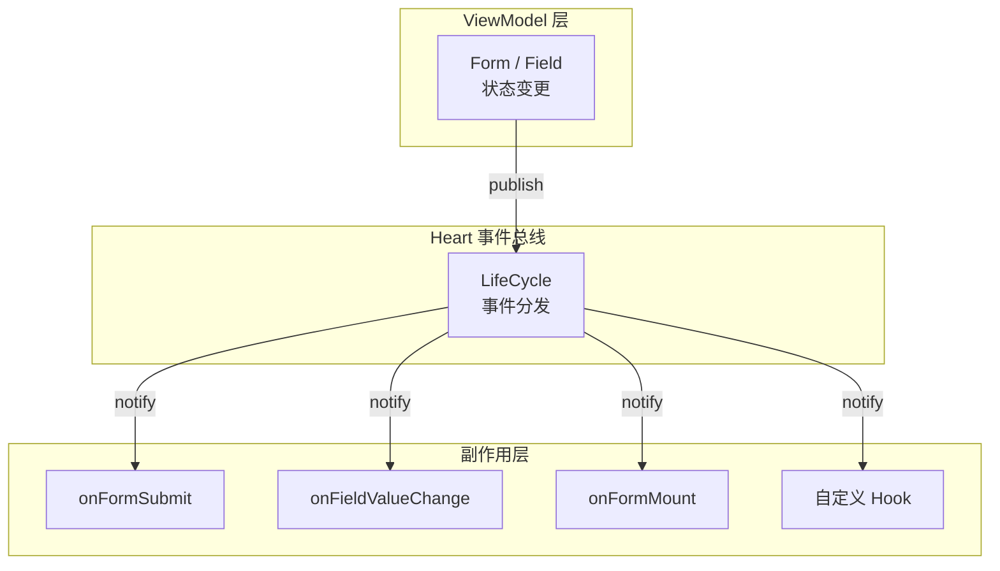

# MVVM 模式

MVVM (Model-View-ViewModel) 是一种 OOP 软件架构模式。`@silver-formily/core` 采用这一模式，将表单的**数据**、**状态**和**副作用逻辑**清晰地分层管理。

我们可以用一张图来描述：



- **View ↔ ViewModel** 通过 DataBinding 双向连接。View 将用户操作传递给 ViewModel，ViewModel 将状态变化通知 View 更新
- **ViewModel → Model** 单向请求。ViewModel 读取和修改 Model 的数据，但 Model 不直接感知 ViewModel 的存在
- 底部标注说明了各层的职责归属：View 和 ViewModel 共同负责展示与展示逻辑，Model 负责业务逻辑和数据

## 三层架构

### Model — 数据层

Model 层由 Form 和 Field 的状态数据结构组成。这些状态通过 `@silver-formily/reactive` 实现响应式，任何读取操作都会自动收集依赖，任何写入操作都会通知订阅者：

```ts
// FormState — 表单级别的数据
interface IFormState {
  values?: T
  initialValues?: T
  errors?: IFormFeedback[]
  valid?: boolean
  submitting?: boolean
}

// FieldState — 字段级别的数据
interface IFieldState {
  value?: ValueType
  inputValue?: ValueType
  errors?: IFormFeedback[]
  valid?: boolean
  selfModified?: boolean
}
```

### ViewModel — 视图模型层

ViewModel 层由 Form 和 Field 实例本身承担，它们暴露了操作状态的命令式 API。ViewModel 通过 `@silver-formily/reactive` 的能力，在状态变化时自动通知 View 更新：

```ts
// Form ViewModel API
form.setValues({ /* ... */ })
form.submit()
form.validate()
form.reset()

// Field ViewModel API
field.setValue('new value')
field.onInput('input value')
field.validate()
field.setValidator({ /* ... */ })
```

### View — 视图层

View 层由 UI 框架负责（如 `@silver-formily/vue`），它订阅 Model 的状态变化并更新 DOM。

## 响应式原理

Core 的响应式基于 `@silver-formily/reactive` 实现，核心机制如下：

### 1. observable 状态

所有 Form 和 Field 的状态都是 observable 的：

```ts
import { observable } from '@silver-formily/reactive'

// Form 内部：将状态标记为 observable
class Form {
  values = observable({})
  initialValues = observable({})
}
```

### 2. 自动依赖收集

在 `autorun` 或 `reaction` 中读取 observable 属性时自动收集依赖：

```ts
import { autorun } from '@silver-formily/reactive'

autorun(() => {
  console.log(form.values.username)
  // 自动订阅 form.values.username 的变化
})
```

### 3. 批量更新 (batch)

通过 `batch` 合并多次状态变更，减少不必要的通知：

```ts
import { batch } from '@silver-formily/reactive'

batch(() => {
  field.setState({ value: 'a' })
  field.setState({ visible: false })
  // 只触发一次更新通知
})
```

## 副作用与生命周期

MVVM 模式中的副作用通过 LifeCycle 系统管理。ViewModel 层的状态变化触发生命周期事件，经由 Heart 事件总线分发给各 Observer：



这些副作用本质上是对 ViewModel 层状态变化的响应，是 View 和 Model 之间的桥梁：

```ts
createForm({
  effects(form) {
    onFormMount((form) => { /* ViewModel 就绪 */ })
    onFieldValueChange('username', (field) => {
      // Model 变化 → 通知 View 更新
    })
  },
})
```
