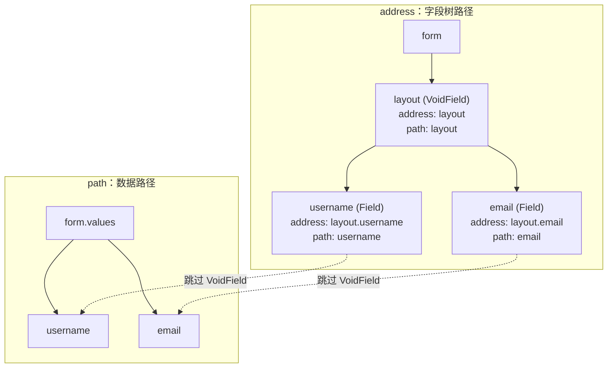

# 路径系统

路径系统是 Formily 连接字段树和表单数据的关键。Form 创建字段、Query 查询字段、Field 表达父子关系、values 深层读写，都依赖同一套路径语义。

## address 与 path

每个字段都有两个路径：

| 路径      | 含义                                       |
| --------- | ------------------------------------------ |
| `address` | 字段在模型树中的绝对位置，包含所有字段节点 |
| `path`    | 数据读写路径，会跳过父级 `VoidField` 节点  |

`VoidField` 是 UI 容器，不参与表单数据。因此它会出现在 `address` 中，但不会出现在子数据字段的 `path` 中。



```ts
form.createVoidField({ name: 'layout' })

const field = form.createField({
  name: 'layout.username',
  value: '',
})

console.log(field.address) // 'layout.username'
console.log(field.path) // 'username'

field.value = 'silver'

console.log(form.values) // { username: 'silver' }
```

## 字段查询

`form.query()` 会按路径表达式查找字段，既可匹配 `address`，也可匹配数据字段的 `path`。

```ts
form.query('layout.username').take()
form.query('username').take()
form.query('users.*.name').map()
form.query('**.email').forEach((field) => {
  field.disabled = true
})
```

常见通配语义：

| 表达式         | 含义                                   |
| -------------- | -------------------------------------- |
| `*`            | 匹配单层路径                           |
| `**`           | 匹配任意层级路径                       |
| `a.b`          | 精确匹配指定路径                       |
| `users.*.name` | 匹配数组项或动态子节点中的 `name` 字段 |

## 字段关系

字段之间的父子关系也通过路径系统表达：

```ts
field.parent // 父字段
field.form // 所属 Form
field.address // 字段树绝对路径
field.path // 数据读写路径
```

在联动场景中，也常通过当前字段反查其他字段：

```ts
field.query('.target').take()
field.query('..parentField').take()
field.form.query('**.email').take()
```

## 数据读写

Form 的深路径读写方法使用同一套 `FormPath` 语义：

```ts
form.setValuesIn('profile.name', 'Silver')

const name = form.getValuesIn('profile.name')

form.deleteValuesIn('profile.name')
```

字段的 `value` 则是基于字段 `path` 的便捷读写：

```ts
const field = form.createField({
  name: 'profile.name',
})

field.value = 'Silver'

console.log(form.values.profile.name) // 'Silver'
```

## 和其他模块的关系

- Form 通过路径创建、查找和批量操作字段
- Field 通过 `path` 读写 `form.values`
- 校验系统通过路径聚合字段反馈
- 联动系统通过路径定位依赖字段和目标字段

更完整的路径表达式能力，请参考 [FormPath API](/api/entry/FormPath) 和 [Query API](/api/models/Query)。
